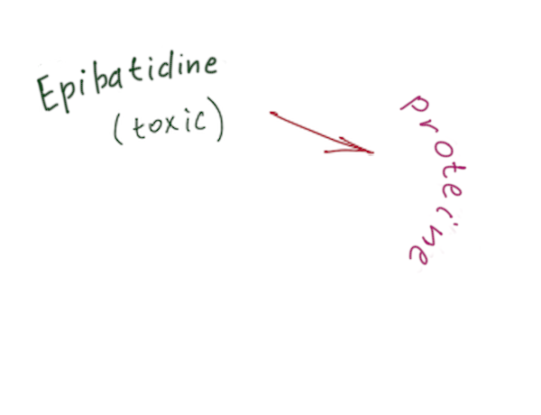
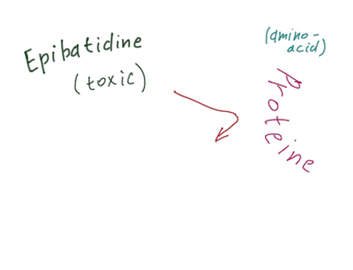
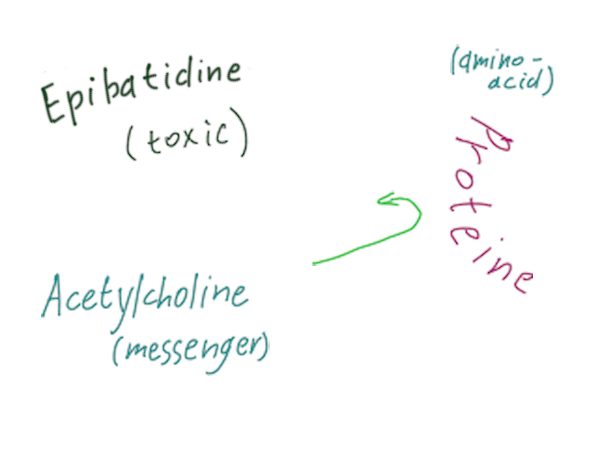
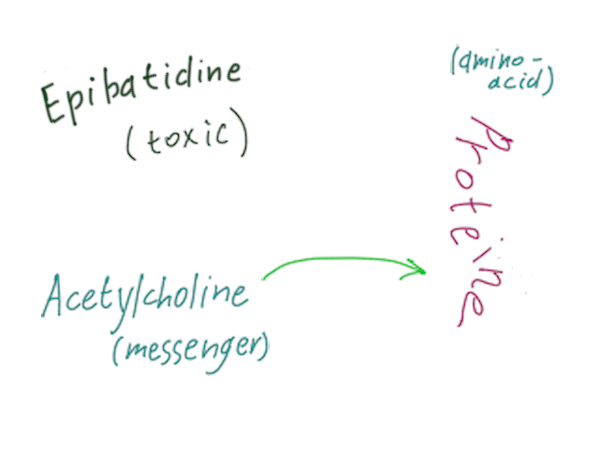

background-image: url( https://www.sciencenewsforstudents.org/sites/default/files/scald-image/092117_LH_posion-frog_main.jpg)
.sign[  <pre>
	https://www.sciencenewsforstudents.org/sites/default/files/scald-image/092117_LH_posion-frog_main.jpg
</pre> ]

---

.middle[
  
.center[
# Why poisonous frogs
# aren't poisonous to themselvs?
]
  
.right_column[
Bondarev Michael  
418 group
]
]

---

# Plan

1. Poison description
2. Amino-acid replacement
3. Recipe differences

---

# Poison

 - Named 'Epibatidine'
 - Secreted from skin
 - Made from toxic food
--
.bottom[  ]
---

# Amino-acid

 - Changes protein's shape
 - Makes connection (almost) impossible
 -  

.bottom[  ]
---
# Amino-acid

 - Changes protein's shape
 - Makes connection (almost) impossible
 - Creates complications for frogs

.bottom[  ]
---

# Additional changes

 - Recipe of protein depends on amino-acids
 - Varies between species
.bottom[  ]
---

class: middle center

## “If cats looked like frogs we'd realize what nasty, cruel little bastards they are.  Style. That's what people remember.”
.right[― Terry Pratchett, Lords and Ladies ]

