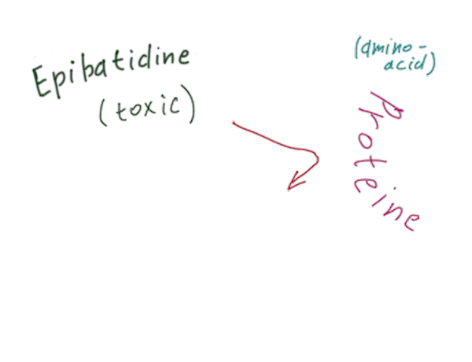
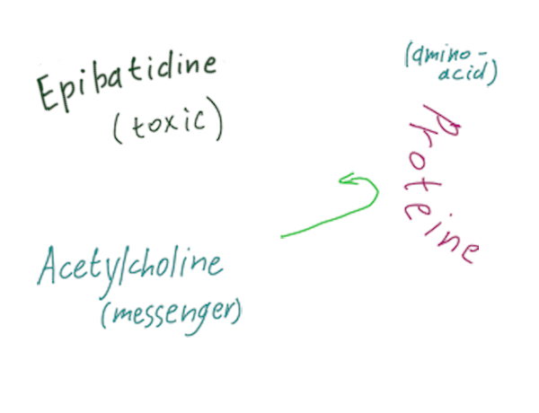

---?image=https://www.sciencenewsforstudents.org/sites/default/files/scald-image/092117_LH_posion-frog_main.jpg

https://www.sciencenewsforstudents.org/article/how-these-poison-frogs-avoid-poisoning-themselves

---

## Why poisonous frogs
## aren't poisonous to themselves?

Bondarev Michael  
418 group

---

## Plan

1. Poison description
2. Amino-acid replacement
3. Recipe differences

---

## Poison

 - Named 'Epibatidine'
 - Secreted from skin
 - Made from toxic food

---

## Amino-acid

 - Changes protein's shape
 - Makes connection (almost) impossible
 -  

---
## Amino-acid

 - Changes protein's shape
 - Makes connection (almost) impossible
 - Creates complications for frogs

---

## Additional changes

 - Recipe of protein depends on amino-acids
 - Varies between species

---

### “If cats looked like frogs we'd realize what nasty, cruel little bastards they are.  Style. That's what people remember.”
― Terry Pratchett, Lords and Ladies

---?image=http://ranchodelicioso.com/wp-content/uploads/2013/05/Frog-and-Laika-2.jpg

http://ranchodelicioso.com/frog-versus-cat/

